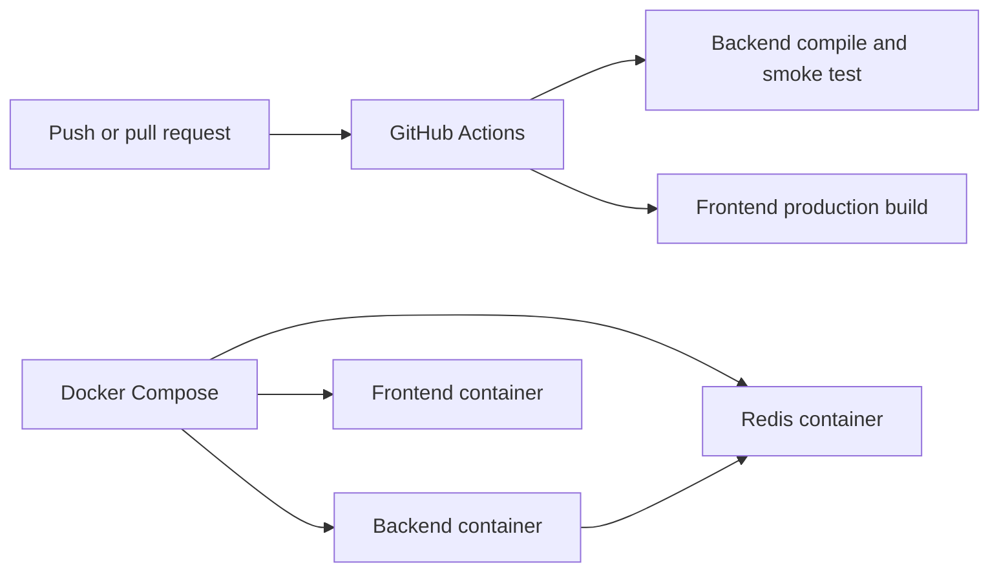

# Enterprise DevOps Report

## Delivered

ReproProof AI now has an additive DevOps and observability layer around the existing FastAPI application. Existing route handlers, API contracts, upload behavior, AI modules, and frontend behavior were preserved.

## New runtime modules

- `backend/app/devops/metrics.py`
  - Thread-safe counters and histograms
  - Prometheus text exposition
  - Request, error, rate-limit, and duration metrics
- `backend/app/devops/middleware.py`
  - Request ID generation and propagation through `X-Request-ID`
  - Request timing
  - Rate limiting
  - Structured request logging
  - Error capture
  - Trace span lifecycle
- `backend/app/devops/rate_limit.py`
  - Sliding-window in-process limiter
- `backend/app/devops/health.py`
  - Liveness and readiness checks
  - Dependency check registration
- `backend/app/devops/queue.py`
  - Bounded async background queue
  - Registered task handlers
  - Worker start/stop lifecycle
  - Guaranteed queue acknowledgement
- `backend/app/devops/audit.py`
  - Structured audit event logger
- `backend/app/devops/ports.py`
  - Redis cache port
  - Trace provider port
  - Error monitor port
  - Background queue port
- `backend/app/devops/observability.py`
  - Local logging-backed error monitor
  - Local trace provider replaceable by OpenTelemetry
- `backend/app/devops/__init__.py`
- `backend/app/api/devops_routes.py`

## New operational APIs

- `GET /metrics`
- `GET /health/live`
- `GET /health/ready`
- `GET /analytics/requests`

The original `/health` endpoint remains unchanged.

## Observability

Each request receives a generated request ID unless the caller supplies `X-Request-ID`. The ID is returned in the response header and included in request logs and error-monitor context.

Metrics include:

- HTTP request total
- HTTP error total
- Rate-limited request total
- Request duration histogram count and sum
- Arbitrary service counters through `MetricsRegistry`

The metrics output is Prometheus-compatible and requires no mandatory third-party package.

Tracing is represented by `TraceProvider`; the default local provider records span boundaries. OpenTelemetry can be injected later without changing middleware callers.

## Health monitoring

- Liveness reports process availability.
- Readiness evaluates registered dependency checks and reports degraded status when a dependency fails.
- Redis, vector stores, databases, and external providers can register readiness checks when configured.

## Background queue and cache

`BackgroundQueue` provides a bounded async local worker implementation for development and single-process deployments. `RedisCache` is a provider port for distributed cache implementations. The production deployment can replace the local queue/cache with Redis-backed workers without changing business services.

## Rate limiting

The default middleware applies a per-client sliding-window limit of 120 requests per 60 seconds. The limiter is deliberately process-local; distributed production deployments should inject a Redis-backed implementation.

## Audit logs

`AuditLogger` emits timestamped JSON events containing action, actor, request ID, and structured details. It is ready to forward to a durable audit sink or SIEM without changing call sites.

## Deployment artifacts

- `docker-compose.yml`
  - Backend
  - Frontend
  - Redis with health check and persistent volume
  - Service dependency health conditions
  - Restart policies
- `backend/Dockerfile`
  - Python 3.13 slim base
  - Non-root user
  - Health check
  - Unbuffered production runtime
- `frontend/Dockerfile`
  - Multi-stage Next.js build
  - Production dependency installation
  - Non-root runtime user
- `backend/.env.production.example`
  - Production-safe configuration template
  - Redis URL
  - CORS
  - rate-limit settings
  - service name
- `.github/workflows/ci.yml`
  - Backend dependency install and compile check
  - Backend application smoke test
  - Frontend `npm ci`
  - Frontend production build

## Deployment flow

## Configuration

Production values are environment-driven through the existing Pydantic settings plus the new production template. Secrets are not committed; the example file documents names and safe defaults only.

## Compatibility

The DevOps middleware is installed at the application factory boundary. Existing handlers do not need request-ID, metrics, or logging code added to them. Existing response payloads are preserved; the request ID is added as a response header, and only rate-limit responses include it in their own error body.

## Validation

Passed:

- DevOps package compilation
- Existing FastAPI application startup
- Operational route registration
- Prometheus exposition smoke test
- Default rate-limit behavior smoke test
- Environment and deployment artifact inspection
- VS Code diagnostics for operational API and application entry point

The HTTP TestClient probe was unavailable because `httpx` is not installed in the configured Python environment. The application-level compile, import, route, and metrics checks passed.

## Production extension points

- Replace local limiter with Redis-backed atomic window limiter.
- Replace local queue with Redis Streams, Celery, Dramatiq, or managed task queue.
- Replace local trace provider with OpenTelemetry exporter.
- Replace logging error monitor with Sentry, OpenTelemetry, or enterprise incident tooling.
- Add durable audit storage and retention policy.
- Add Prometheus scrape configuration and Grafana dashboards.
- Add image scanning, SBOM generation, signed artifacts, and deployment promotion gates to CI/CD.
