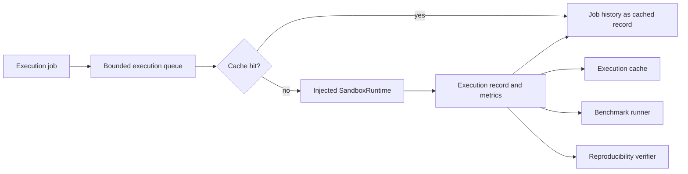

# Execution Engine Report

## Delivered

ReproProof AI now has an `app.execution` bounded context for enterprise sandbox orchestration. It extends the existing sandbox architecture without replacing the current execution engine or changing existing API contracts.

## Modules

- `backend/app/execution/models.py`
  - Resource limits
  - Execution jobs and lifecycle status
  - Execution records and metrics
  - Environment reports
  - Benchmark reports
  - Reproducibility reports
  - Docker sandbox specifications
- `backend/app/execution/ports.py`
  - `SandboxRuntime` provider boundary
  - `ExecutionCache` port
  - `JobHistory` port
- `backend/app/execution/repositories.py`
  - Thread-safe in-memory cache
  - Thread-safe in-memory job history
- `backend/app/execution/service.py`
  - Bounded async execution admission through `ExecutionQueue`
  - Queue acknowledgement with `task_done`
- `backend/app/execution/docker.py`
  - Docker invocation specification builder
- `backend/app/execution/environment.py`
  - Non-executing virtual environment, language, runtime, and dependency detection
- `backend/app/execution/service.py`
  - Enterprise orchestration service
  - Cache key generation
  - Queue-backed execution
  - Parallel execution
  - Benchmark runner
  - Reproducibility verification
  - Job history persistence
- `backend/app/api/execution_routes.py`
  - Additive environment, Docker specification, and job history APIs

## Security model

The engine does not execute repository code directly on the application host. Runtime execution requires an injected `SandboxRuntime` implementation. This supports Docker, Firecracker, Kubernetes, or Cloud Run without coupling the domain to one provider.

Generated Docker specifications default to:

- Network disabled
- Read-only repository mount
- Non-root UID/GID
- CPU limit
- Memory limit
- PID limit
- Writable no-exec temporary filesystem
- Explicit timeout carried by the job contract
- Minimal image selection

The existing `SandboxExecutionEngine` remains available for the current application flow and is not replaced.

## Resource limits

`ResourceLimits` validates:

- CPU count greater than zero and bounded to 64
- Positive memory allocation
- Timeout between one second and 24 hours
- Positive PID limit
- Network disabled by default

## Execution flow

## API additions

- `GET /execution-engine/environment?path=...`
- `POST /execution-engine/docker-spec`
- `GET /execution-engine/history`

These are additive APIs. Existing execution endpoints and response contracts are unchanged.

## Environment reconstruction

`EnvironmentDetector` identifies Python, Node, Java, and Rust source, virtual-environment markers, package managers, dependency manifests, and runtime files without installing packages or executing project code.

## Cache and history

Cache keys are derived from the repository ID, approved path, command, resource limits, and environment hash while excluding transient job identity. Cached responses receive the submitting job's own ID and timestamp, preserving complete job history even under concurrent submissions.

## Benchmarking and reproducibility

- `benchmark` executes an approved job through the configured sandbox provider for a requested number of iterations and records runtime statistics.
- `verify_reproducibility` compares SHA-256 digests of stdout, stderr, and exit code across sandboxed runs.
- No host execution is performed by either feature.

## Validation

Passed:

- Execution package compilation
- Docker resource-control smoke test
- Environment detection against an existing uploaded repository
- Additive API route registration
- Parallel execution smoke test with a safe fake runtime
- Cache behavior verification
- Benchmark success verification
- Reproducibility digest verification
- Job history retention verification
- Existing backend startup compatibility

The full pytest suite was not run because pytest is not installed in the configured environment.

## Future extension points

- Docker runtime adapter implementing `SandboxRuntime`
- Firecracker or Kubernetes runtime adapters
- Redis/database-backed cache and history
- Persistent execution logs and event streaming
- Queue workers with cancellation and admission policies
- CPU and memory telemetry from the selected runtime
- Environment lockfile reconstruction and image build orchestration
