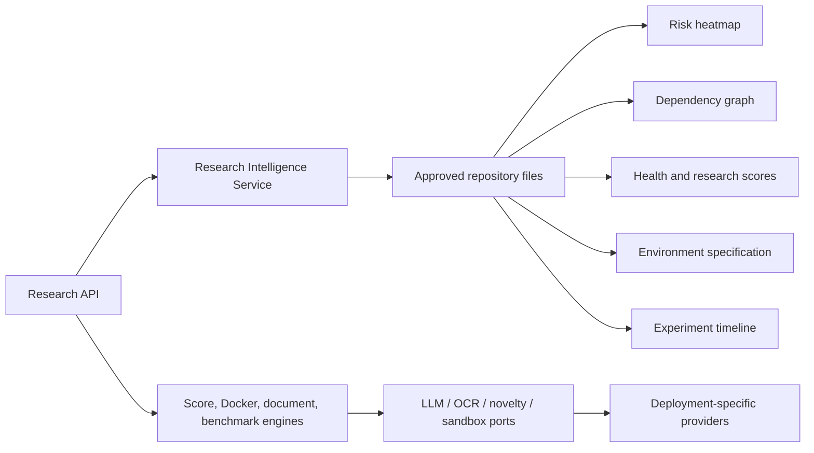
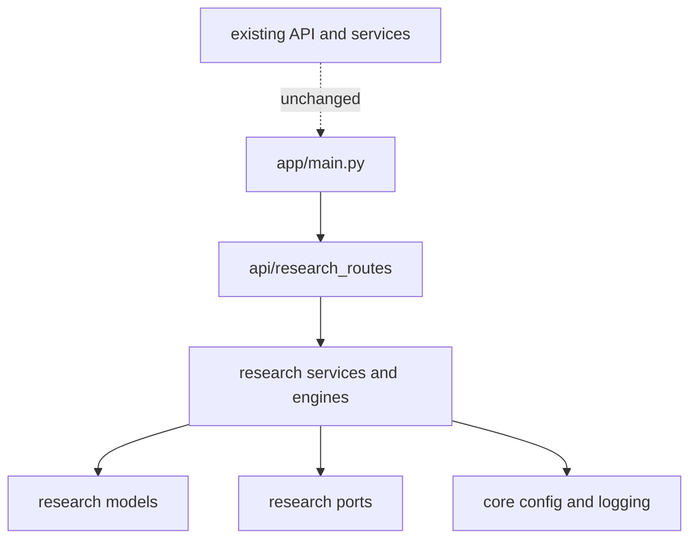

# Feature Implementation Report

## Milestone delivered

This milestone extends the existing multi-agent architecture with a modular research and repository intelligence bounded context. Existing routes, upload handling, repository analysis, execution services, frontend behavior, and API contracts were preserved.

## New modules

- `backend/app/research/models.py`: validated DTOs for risks, dependency graphs, scores, timelines, datasets, documents, benchmarks, execution metadata, Docker output, and explainability.
- `backend/app/research/services.py`: deterministic repository risk, dependency, health, environment, timeline, and CSV quality analysis.
- `backend/app/research/engines.py`: shared scoring, explainability, Docker generation, document processing, research assistant, benchmark, and secure execution boundaries.
- `backend/app/research/ports.py`: provider interfaces for LLM, OCR, novelty, and sandbox implementations.
- `backend/app/research/errors.py`: bounded-context errors.
- `backend/app/api/research_routes.py`: additive dashboard REST API.

## New APIs

- `GET /research/{repository_id}/risk-heatmap`
- `GET /research/{repository_id}/dependency-graph`
- `GET /research/{repository_id}/health`
- `GET /research/{repository_id}/environment`
- `GET /research/{repository_id}/timeline`
- `GET /research/{repository_id}/scores/{score_name}`
- `GET /research/dataset?path=...`
- `POST /research/dockerfile`

Responses use Pydantic models and are ready for graph, heatmap, scorecard, timeline, and dashboard consumers.

## Architecture decisions

- Evidence-driven analysis is deterministic and does not pretend to be an LLM.
- LLM, OCR, novelty, and sandbox implementations are ports. No vendor, model, or dangerous host execution is hardcoded.
- The existing API router remains unchanged; the research router is included additively from the application factory.
- Repository paths are constrained to the configured upload directory at the API boundary.
- Docker generation uses non-root users, slim/alpine stages, production builds, and a backend health check.
- All feature state is returned as explicit DTOs instead of untyped route dictionaries.

## Data flow

## Dependency diagram

## Performance considerations

- Repository scans are bounded to files below ignored operational directories.
- Python dependency analysis uses the standard-library AST parser and skips invalid files.
- Score calculation is O(n) over collected evidence.
- Dependency cycle detection is graph traversal over discovered local imports.
- PDF parsing uses an optional `pypdf` adapter or an injected OCR provider; no network call is implicit.
- Benchmarking measures only an explicitly supplied approved callable. Secure repository execution remains provider-dependent and disabled without a sandbox.

## Future extension points

- Register production Repository, Research Paper, Dataset, Execution, Security, Repair, Reviewer, and Judge agents through the existing agent registry.
- Add JSON, Parquet, and Excel parser adapters with explicit optional dependencies.
- Add persistent score and confidence history storage.
- Add queue-backed event delivery and concurrent independent workflow branches.
- Provide Docker, Firecracker, Kubernetes, or Cloud Run sandbox implementations.
- Add real LLM, OCR, and novelty providers through dependency injection.
- Add report-backed timeline events from execution and repair history.

## Remaining work

The architecture is ready, but provider-dependent AI capabilities intentionally have no fake fallback. Production agent implementations, durable persistence, optional dataset parser packages, and full regression tests should be delivered as separate milestones. The configured environment currently lacks `pytest`, so the existing test suite could not be executed during this milestone.

## Verification

Passed:

- `compileall` for `app/research` and the new API router
- Import and startup smoke test for the existing FastAPI application
- Registration checks for all additive research routes
- Repository intelligence smoke test against the backend source
- Score and Docker engine smoke tests
- VS Code diagnostics for the touched application files

No existing endpoint or frontend module was rewritten.
