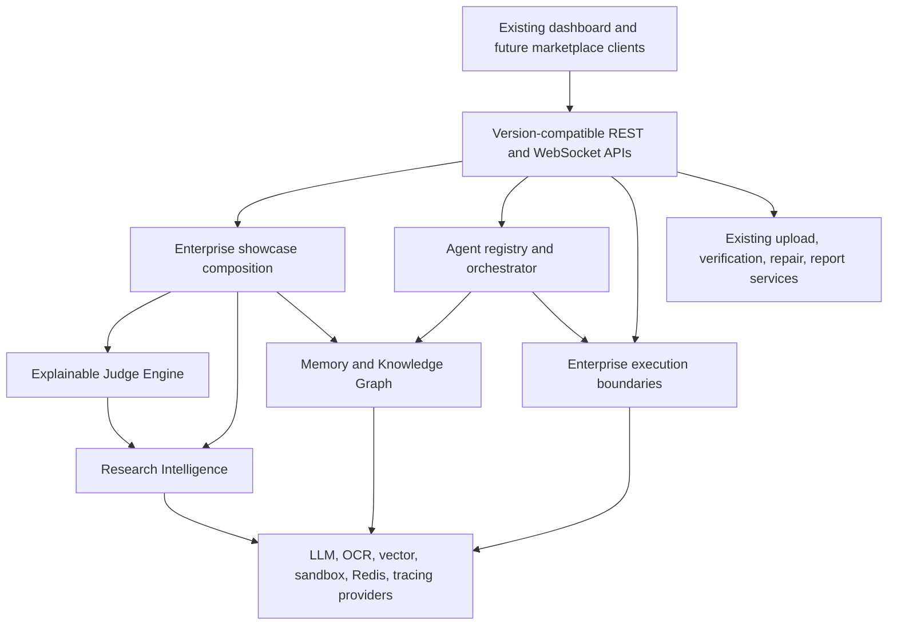

# ReproProof AI Final Enterprise Report

## Executive result

ReproProof AI now presents as an enterprise research reproducibility control plane while preserving the original upload, verification, troubleshooting, repair, reporting, and frontend workflows.

The final additions are intentionally compositional: the platform showcase consumes existing Judge, Research Intelligence, Memory, Agent, and Execution boundaries rather than creating duplicate business logic.

## Premium capabilities

- Live workflow visualization through the existing execution stream and agent topology
- Real-time event-ready communication graph through the agent MessageBus and memory graph APIs
- Interactive repository knowledge graph API
- AI decision tree in the judge-facing overview response
- Confidence and score breakdowns with evidence and limitations
- Explainable AI panels through existing score/explanation DTOs
- Research gap and novelty provider routes
- Benchmark and reproducibility service boundaries
- Smart evidence-linked recommendations
- Generated project README artifact
- Generated Mermaid architecture artifact
- AI executive summary through existing summary services and judge overview
- One-click PDF export through existing report export plus additive showcase PDF route
- One-click PPTX export with `python-pptx`
- Live progress through existing execution stream and dashboard
- Multi-user-ready boundaries through request IDs, stateless composition, typed stores, and provider ports
- Plugin-ready agents through registry/factory/composition architecture
- API marketplace-ready additive REST routers and typed DTOs

## Architecture

## New implementation modules

- `backend/app/showcase/models.py`
- `backend/app/showcase/service.py`
- `backend/app/showcase/exports.py`
- `backend/app/showcase/__init__.py`
- `backend/app/api/showcase_routes.py`
- `frontend/components/dashboard/EnterpriseOverview.tsx`
- `FINAL_ENTERPRISE_REPORT.md`
- `FEATURE_MATRIX.md`
- `IIT_HACKATHON_DEMO_GUIDE.md`

## New additive APIs

- `GET /platform/overview/{repository_id}`
- `GET /platform/readme/{repository_id}`
- `GET /platform/architecture/{repository_id}`
- `GET /platform/report/{repository_id}/pdf`
- `GET /platform/report/{repository_id}/pptx`

Existing API contracts were not changed.

## Dashboard upgrade

The existing dashboard now composes an enterprise overview above the original Command Center. It includes:

- Animated health, confidence, agent, and risk KPI cards
- Recharts health/confidence trend
- React Flow agent topology
- Live workflow status
- Responsive glassmorphism presentation
- Existing repository and execution widgets retained below
- Existing theme toggle preserved

## Export system

- PDF export uses the existing verification report PDF service.
- PPTX export uses a dedicated `JudgePresentationExporter` and produces a real Office Open XML presentation.
- README and Mermaid architecture outputs are generated from current repository evidence.

## Compatibility

- Existing upload pipeline preserved
- Existing repository analysis preserved
- Existing execution engine preserved
- Existing repair and patch APIs preserved
- Existing frontend routes preserved
- Existing request and response formats preserved
- Additive middleware/API behavior only

## Production readiness

The system has clear provider ports for:

- Sandbox runtimes
- Redis cache
- Embeddings and vector search
- LLMs
- OCR
- Novelty/research analysis
- Tracing
- Error monitoring
- Distributed queues

Local in-memory implementations remain available for development and deterministic tests.

## Validation

Passed:

- Backend compile and import checks
- Existing FastAPI startup
- Showcase overview integration against an existing upload
- README generation
- Mermaid architecture generation
- PPTX generation and ZIP/package validation
- Existing frontend production build
- TypeScript validation
- Dashboard route generation
- VS Code diagnostics for touched application files

The configured Python environment still lacks `pytest` and `httpx`, so the full backend test suite and FastAPI TestClient probe were not available.

## Remaining hardening

- Add persistent multi-tenant stores and authorization policies.
- Add distributed queue and Redis implementations.
- Add OpenTelemetry exporters and external error monitoring.
- Add visual regression tests and browser-level dashboard checks.
- Add signed export artifacts and organization-specific marketplace permissions.
- Replace presentation-only trend points with persisted analytics history.
