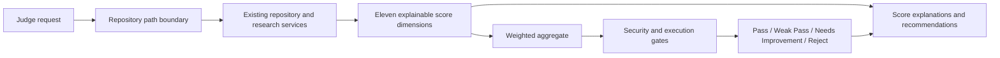

# Enterprise AI Judge Engine Report

## Delivered

ReproProof AI now has an explainable `JudgeEngine` that composes existing repository, risk, health, dataset, environment, and execution evidence into a final evaluation. It does not replace the existing verification report or alter existing API contracts.

## Modules

- `backend/app/judge/models.py`
  - `Verdict`
  - `ScoreExplanation`
  - `JudgeRequest`
  - `JudgeReport`
- `backend/app/judge/service.py`
  - `JudgeEngine`
  - weighted score aggregation
  - evidence and rationale generation
  - confidence calculation
  - verdict policy
- `backend/app/judge/__init__.py`
- `backend/app/api/judge_routes.py`

## New API

```text
POST /judge/evaluate
```

Request example:

```json
{
  "repository_id": "upload-id",
  "execution_success": true,
  "execution_confidence": 0.9,
  "dataset_path": "/approved/upload/path/dataset.csv",
  "research_paper_path": "/approved/upload/path/paper.pdf"
}
```

The repository is resolved through the configured upload directory. Dataset paths must remain inside the evaluated repository.

## Score dimensions

The report contains:

- Repository Score
- Code Quality
- Architecture Score
- Research Integrity
- Publication Readiness
- Reproducibility
- Security
- Maintainability
- Novelty
- Dataset Quality
- Execution Success
- Overall Score
- Judge Confidence

Every score is a `ScoreExplanation` containing:

- normalized score from 0 to 100
- observable evidence
- calculation rationale
- confidence in the score
- limitations or improvement requirements

## Scoring policy

The overall score is a weighted average:

| Dimension | Weight |
| --- | ---: |
| Repository score | 12% |
| Code quality | 10% |
| Architecture | 10% |
| Research integrity | 12% |
| Publication readiness | 8% |
| Reproducibility | 14% |
| Security | 10% |
| Maintainability | 8% |
| Novelty | 5% |
| Dataset quality | 5% |
| Execution success | 6% |

All values are bounded to 0-100 before aggregation.

## Verdict policy

- `Pass`: overall score is at least 80, with no critical security or execution failure gate.
- `Weak Pass`: overall score is at least 60 and below 80.
- `Needs Improvement`: overall score is at least 45 and below 60.
- `Reject`: overall score is below 45, security is below 30, or execution success is below 30.

A failed execution or severe security risk therefore cannot be hidden by strong documentation or architecture scores.

## Evidence sources

- Existing `ResearchIntelligenceService` risk, health, environment, and dataset analysis
- Repository file inventory
- Python AST syntax validation
- README and license presence
- Dependency and runtime markers
- Optional execution success input from an approved sandbox result
- Optional paper and dataset presence

Novelty is intentionally scored as provisional when no external novelty corpus/provider is configured. The report includes a limitation and recommends provider configuration rather than claiming unsupported novelty.

## Data flow



## Architecture decisions

- The judge is an application-layer composition service, not a second repository analyzer.
- Existing scoring and analysis services remain the source of truth for their domains.
- Pydantic DTOs make score contracts explicit and frontend-ready.
- No LLM is required for baseline evaluation.
- External novelty or research judgment can be added later through the existing provider architecture.
- The endpoint is additive and existing frontend/API behavior remains unchanged.

## Validation

Passed:

- Judge package compilation
- FastAPI startup and route registration
- Integration evaluation against an existing uploaded repository
- All eleven score keys present
- Score and confidence bounds validated
- Evidence and rationale present for every score
- Verdict enum validation
- Existing backend compatibility check
- VS Code diagnostics for judge and API modules

Sample integration result:

- Verdict: `Weak Pass`
- Overall score: `61.06`
- Judge confidence: `0.77`

The full pytest suite was not run because pytest is not installed in the configured environment.

## Future extension points

- Persist score history and judge decisions.
- Add calibrated confidence history across repository evaluations.
- Add provider-backed novelty and claim verification evidence.
- Consume structured execution records directly from the sandbox history store.
- Add configurable weights and organization-specific verdict policies.
- Add signed evaluation reports for publication and audit workflows.
