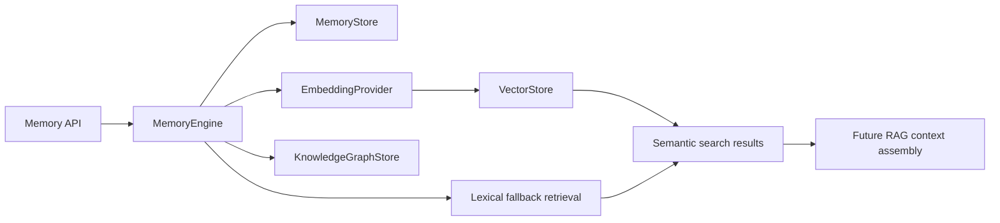

# Enterprise Memory Engine Report

## Delivered

ReproProof AI now has a provider-independent `app.memory` bounded context for repository, research, dataset, execution, patch, and conversation memory. It supports structured records, knowledge-graph relations, lexical retrieval today, and provider-backed embedding/vector retrieval when configured.

## New modules

- `backend/app/memory/models.py`
  - Memory namespaces and records
  - Search queries and results
  - Embeddings
  - Knowledge graph nodes, edges, and graphs
  - Memory and graph request DTOs
- `backend/app/memory/ports.py`
  - `EmbeddingProvider`
  - `VectorStore`
  - `MemoryStore`
  - `KnowledgeGraphStore`
- `backend/app/memory/stores.py`
  - Thread-safe in-memory memory store
  - Thread-safe in-memory knowledge graph store
- `backend/app/memory/engine.py`
  - Memory writes
  - Optional embedding/vector indexing
  - Lexical fallback retrieval
  - Semantic retrieval routing
  - Cross-namespace context retrieval
  - Graph node and relation management
- `backend/app/memory/__init__.py`
- `backend/app/api/memory_routes.py`

## Memory namespaces

- Repository Memory
- Research Memory
- Dataset Memory
- Execution Memory
- Patch History
- Conversation Memory

Namespaces are explicit enum values, preventing unrelated memories from being mixed accidentally while still allowing cross-namespace retrieval when requested.

## New APIs

- `POST /memory/records`
- `POST /memory/search`
- `POST /memory/context`
- `POST /memory/graph/relations`
- `GET /memory/graph`

All APIs use validated Pydantic request/response models.

## Knowledge graph

The graph layer supports:

- Typed nodes
- Directed weighted relations
- Metadata on nodes
- Graph retrieval by subject ID
- Upsert semantics for nodes and edges

Example relations include:

- repository `contains` module
- paper `supports` claim
- dataset `used_by` experiment
- execution `produced` report
- patch `fixes` finding
- conversation `references` decision

The graph store is a port, so Neo4j, PostgreSQL, or another graph backend can be added without changing memory callers.

## Retrieval architecture

When both an embedding provider and vector store are configured, retrieval uses semantic vectors. Without them, the engine uses a deterministic token-overlap fallback so local development remains functional without pretending to provide embeddings.

## Provider independence

`EmbeddingProvider` defines model-neutral embedding generation with provider name and dimensions. `VectorStore` defines upsert and filtered nearest-neighbor search. These ports support future implementations using hosted APIs, local models, pgvector, Qdrant, Pinecone, Milvus, or an internal platform.

No vendor, model, API key, or network dependency is hardcoded.

## RAG readiness

The engine exposes `retrieve_context`, which can search across selected namespaces and returns ranked `SearchResult` objects containing the original record and match type. A future RAG application service can pass these evidence records to an LLM provider while preserving source IDs and metadata for citations.

The current implementation intentionally does not call an LLM or generate answers.

## Data flow

1. A caller writes a typed memory record with namespace, subject, content, and metadata.
2. The memory store persists the record.
3. If embedding/vector providers are configured, the record is embedded and indexed.
4. Search applies namespace and subject filters.
5. Semantic or lexical retrieval returns ranked records with match type.
6. Graph relations are stored separately and can connect memory subjects without coupling agents.

## Safety and consistency

- Empty memory content is rejected.
- Query length and result limits are bounded.
- In-memory adapters use locks for thread-safe access.
- Vector retrieval is opt-in through dependency injection.
- No provider secrets or network calls are implicit.
- Existing agent workflow memory remains unchanged; this engine is the durable/provider-ready boundary.

## Validation

Passed:

- Memory package compilation
- Memory model and store import check
- Namespace-filtered retrieval smoke test
- Knowledge graph relation smoke test
- Memory API function smoke test
- Existing FastAPI startup compatibility
- All additive memory route registration
- VS Code diagnostics for touched API modules

The full pytest suite was not run because pytest is not installed in the configured environment.

## Future extension points

- Durable SQL/document memory store
- Graph database adapter
- Embedding provider adapters
- Vector database adapter
- TTL and retention policies
- Access control and tenant isolation
- Memory provenance and versioning
- Hybrid lexical plus vector ranking
- RAG context assembly with source citations
- Conversation summarization and compaction
- Agent-specific read/write policies
