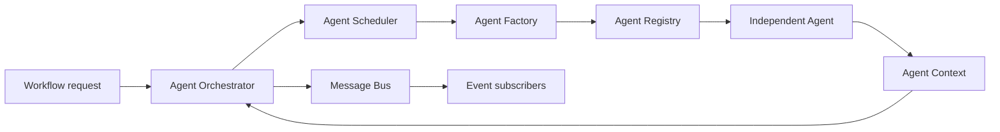
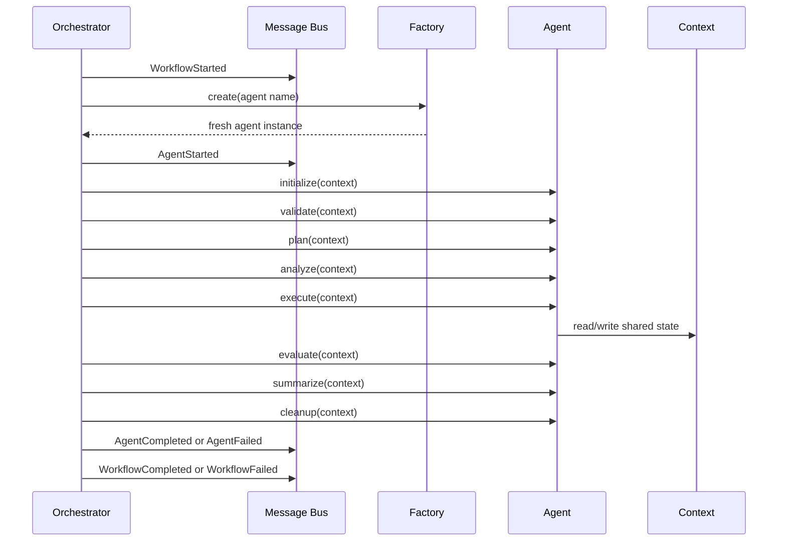

# ReproProof AI Multi-Agent Architecture

## Scope

This milestone introduces the pluggable agent framework only. No production agent is registered, no existing route is rewired, and no API request or response contract changes. Existing repository analysis, execution, repair, and reporting services remain the active runtime.

## Framework location

The framework lives in `backend/app/ai/framework`:

- `contracts.py`: lifecycle contract, metadata, status, and result models
- `context.py`: workflow-scoped shared context
- `memory.py`: workflow-scoped key/value memory
- `events.py`: event types and event payloads
- `message_bus.py`: in-process publish/subscribe bus
- `registry.py`: named agent plugin registry
- `factory.py`: fresh agent instance creation
- `workflow.py`: dependency graph validation and topological ordering
- `scheduler.py`: configurable workflow scheduling boundary
- `orchestrator.py`: lifecycle execution, retries, events, aggregation, and metrics

## Agent responsibilities

The first production plugins are planned as independent agents:

| Agent | Responsibility |
| --- | --- |
| Repository | Structure, technology, dependencies, health, and summary |
| Research Paper | Methodology, algorithms, implementation comparison, and reproducibility checklist |
| Dataset | Schema, missing values, features, data quality, and validation |
| Execution | Build, runtime, logs, failures, profiling, and execution report |
| Security | Secrets, vulnerabilities, misconfiguration, risk, and recommendations |
| Repair | Root cause, patch planning, prioritization, and safe patch generation |
| Reviewer | Cross-agent consistency, validation, and confidence scoring |
| Judge | Final evaluation, reproducibility score, explainability, and verdict |

These agents are deliberately not implemented or registered in this milestone.

## Communication flow

Agents never import or invoke another agent. The orchestrator owns execution and passes one shared context to each lifecycle method.



## Context model

`AgentContext` is the workflow data boundary. It contains repository information, metadata, execution results, logs, security and risk findings, dataset information, research findings, patch suggestions, confidence scores, intermediate results, execution history, and shared memory.

Agents should use `context.get`, `context.set`, and `context.update`. They should not reach into another agent instance or own a second copy of workflow state.

`AgentMemory` is a separate workflow-scoped store for transient coordination data. A future persistence adapter can replace it without changing the agent contract.

## Execution sequence



## Workflow engine

A workflow is a named collection of `WorkflowStep` values. Each step names an agent, optionally lists dependencies, and defines a retry count. The workflow engine validates missing dependencies, duplicate names, negative retries, and cycles before execution. The scheduler returns a deterministic dependency-respecting order.

The current scheduler executes that order sequentially. A future scheduler may run independent branches concurrently while preserving the same workflow and agent contracts.

## Plugin architecture

Adding an agent does not require modifying existing framework code:

1. Create a package implementing `Agent`.
2. Provide `AgentMetadata` and all lifecycle methods.
3. Register its factory during application composition:

```python
registry.register("repository", RepositoryAgent)
```

4. Add the name to a workflow configuration:

```python
WorkflowStep("repository")
```

The registry rejects empty and duplicate names. The factory creates a fresh instance for each workflow step, preventing state leakage between runs.

## Event system

The bus supports:

- `AgentStarted`
- `AgentCompleted`
- `AgentFailed`
- `WorkflowStarted`
- `WorkflowCompleted`
- `WorkflowFailed`
- `ContextUpdated`

Subscribers may be synchronous or asynchronous. Events retain an in-process history for diagnostics. A later adapter can forward the same event model to a queue or telemetry platform.

## Observability

Each completed agent result currently records:

- wall-clock duration
- process CPU time
- attempt count
- confidence score

Failure results retain duration and attempts. Token usage and memory usage are intentionally future extension points because the current agents do not depend on an LLM runtime.

## Stability boundary

The framework is isolated and currently has no import path from `backend/app/main.py` or active API routes. This preserves existing frontend behavior, API contracts, reports, upload handling, and execution services while the framework is validated independently.

The next milestone is composition and adapter testing, followed by one production agent at a time. Multi-agent workflows should not be connected to production endpoints until regression tests cover the existing flows.

## Roadmap

1. Add composition-root registration and framework-specific tests.
2. Add an adapter around the existing repository analysis service.
3. Add execution and report adapters without changing route contracts.
4. Add security, research paper, and dataset plugins.
5. Add repair, reviewer, and judge plugins.
6. Introduce durable event delivery, persistent memory, queue-backed scheduling, and operational dashboards.
