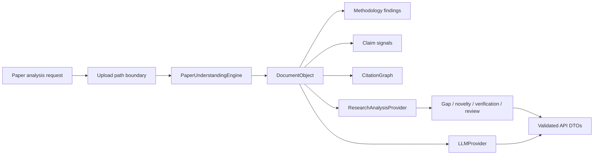

# Research Intelligence Engine Report

## Delivered

ReproProof AI now has an extensible research intelligence engine layered on the existing `app.research` bounded context. Existing APIs and frontend behavior remain unchanged.

## New modules

- `backend/app/research/paper_engine.py`
  - `PaperUnderstandingEngine`
  - `CitationGraphEngine`
  - `ProviderResearchEngine`
  - provider-backed `ResearchAssistant`
- `backend/app/api/paper_routes.py`
- Extended `backend/app/research/models.py` with paper, citation, methodology, provider, and request DTOs.
- Extended `backend/app/research/ports.py` with `ResearchAnalysisProvider`.
- Extended `backend/app/research/__init__.py` public exports.

## Capabilities

### Deterministic local capabilities

- PDF/text document ingestion
- Optional PDF extraction through `pypdf`
- OCR fallback through injected `OCRProvider`
- Markdown-style section detection
- Section-body extraction
- Methodology signal extraction
- Claim signal extraction
- Citation marker extraction
- Citation graph generation
- Structured paper summaries

These capabilities use observable document evidence and do not invent research conclusions.

### Provider-backed capabilities

The following capabilities are routed through `ResearchAnalysisProvider`:

- Research gap detection
- Novelty detection
- Claim verification
- Benchmark comparison
- Research recommendations
- Future work generation
- Automatic literature review
- Automatic reviewer analysis

The research assistant uses the existing provider abstraction and requires an injected `LLMProvider`. No LLM vendor or model is hardcoded.

## New APIs

- `POST /research/paper/analyze`
- `POST /research/paper/capability/{capability}`
- `POST /research/paper/assistant`

Paper paths are accepted only from the configured upload directory. Missing providers return `503 Service Unavailable` rather than fabricated output.

## Data flow

## Architecture decisions

- Paper functionality is isolated from repository analysis and existing AI modules.
- Existing document parsing is reused through `DocumentUnderstandingEngine`.
- `ResearchAnalysisProvider` is the single port for higher-order research synthesis.
- `LLMProvider` remains vendor-neutral.
- Every response is represented by a Pydantic model.
- Provider absence is explicit and safe.
- The new router is additive and does not modify existing endpoint contracts.

## Extension guide

1. Implement `ResearchAnalysisProvider.name` and `analyze`.
2. Inject the provider in the application composition root.
3. Route the required capability name from the supported capability list.
4. Persist provider metadata and evidence references with the result.
5. Add unit tests for provider success, timeout, invalid output, and unavailable-provider behavior.

For PDF/OCR support, implement `OCRProvider.extract_text`. For a different LLM vendor, implement `LLMProvider.complete`. Existing consumers do not need to change.

## Performance and safety

- Text analysis is linear in document size for the primary scans.
- Citation and claim lists are bounded to prevent unbounded response growth.
- PDF processing is optional-dependency aware.
- No repository code is executed by the research engine.
- File paths are confined to configured uploads at the API boundary.

## Validation

Passed:

- Backend compilation for all research and paper API modules
- FastAPI import and paper-route registration
- Paper parsing against an existing uploaded research README
- Section and summary extraction regression check
- Provider-unavailable behavior for novelty detection
- Existing frontend build remains previously validated with `npm run build`
- No diagnostics in touched API/application modules

## Remaining work

- Add concrete production provider adapters through deployment configuration.
- Add parser adapters for tables, figures, references, JSON/PDF metadata, and OCR page coordinates.
- Add persistent citation corpus and literature index storage.
- Add individual pytest suites for every engine and provider failure mode.
- Add frontend API consumers only after the research response contracts are product-approved.
