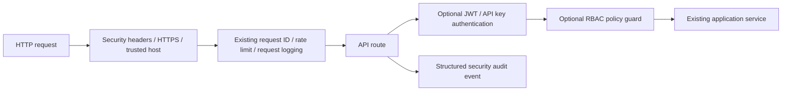

# Enterprise Security Implementation Report

## Files Added

- `backend/app/security/__init__.py`
- `backend/app/security/models.py`
- `backend/app/security/ports.py`
- `backend/app/security/auth.py`
- `backend/app/security/authorization.py`
- `backend/app/security/validators.py`
- `backend/app/security/headers.py`
- `backend/app/security/middleware.py`
- `backend/app/security/audit.py`
- `backend/.env.production.example` security configuration entries

## Files Modified

- `backend/app/core/config.py`
  - Added centralized security settings and trusted-host parsing.
- `backend/app/main.py`
  - Installed security middleware at the application factory boundary.
- `backend/requirements.txt`
  - Added `PyJWT==2.14.0`.

No existing endpoint handler, request model, response model, frontend file, or business service was rewritten.

## Security Features

### Authentication

- JWT access-token issuance
- JWT refresh-token issuance and validation
- JWT revocation tracking
- HMAC secret length enforcement for production safety
- API-key authentication with SHA-256 key lookup
- OAuth2 provider interface
- Service-to-service authentication interface
- Token provider abstraction for alternate implementations

No secret is hardcoded. `JWT_SECRET_KEY` must be supplied through environment configuration and must be at least 32 bytes for HMAC algorithms.

### Authorization

RBAC roles:

- Admin
- Researcher
- Reviewer
- Judge
- Viewer

Permission-based policy checks support:

- Read
- Upload
- Execute
- Review
- Judge
- Export
- Admin

`RBACPolicy.require()` is ready for opt-in route guards. Existing routes are not forcibly protected in this milestone to preserve backward compatibility.

### Security middleware

- Security headers middleware
- Configurable HTTPS redirect
- Configurable trusted-host validation
- Existing DevOps request-ID middleware retained as the single request-ID owner
- Existing DevOps rate limiter retained as the current rate-limit owner
- Existing request logging retained without duplication

Headers added:

- `X-Content-Type-Options: nosniff`
- `X-Frame-Options: DENY`
- `Content-Security-Policy`
- `Referrer-Policy`
- `Permissions-Policy`

### Input validation

- HTTP(S) repository URL validation
- Credential rejection in repository URLs
- Filename sanitization
- ZIP extension validation
- Content-type validation using existing upload allowlists
- ZIP archive path traversal protection
- Safe archive destination containment checks

### Audit logging

`SecurityAuditLogger` tracks structured events for:

- Login
- Repository upload
- Agent execution
- Judge evaluation
- Export generation
- Security events

The logger includes action, actor, request ID, timestamp, success status, and structured details.

## APIs Impacted

No existing API contracts were changed.

The security middleware adds response headers to existing responses. It does not change existing response bodies or status semantics when security configuration remains at development defaults.

Authentication and authorization are exposed as reusable services and policies rather than automatically enforced on legacy routes. This avoids breaking existing frontend/API consumers while allowing new protected routes to opt into guards.

## Centralized configuration

Added environment-driven settings:

- `JWT_SECRET_KEY`
- `JWT_ALGORITHM`
- `ACCESS_TOKEN_EXPIRE_MINUTES`
- `REFRESH_TOKEN_EXPIRE_DAYS`
- `SECURITY_HEADERS_ENABLED`
- `REQUIRE_HTTPS`
- `TRUSTED_HOSTS`
- `SECURITY_RATE_LIMIT_REQUESTS`
- `SECURITY_RATE_LIMIT_WINDOW_SECONDS`

The production template documents these values without containing secrets.

## Architecture flow

## Validation Results

Passed:

- Security package compilation
- Full backend compilation
- Backend startup/import
- Existing API route registration
- Representative enterprise API route registration
- JWT access-token issuance and validation
- Refresh-token validation
- JWT revocation
- HMAC secret length enforcement
- API-key authentication
- RBAC allow/deny behavior
- Repository URL validation
- Filename sanitization
- Archive traversal rejection
- Live security headers
- Live request-ID preservation
- Full backend regression suite: `59 passed, 1 skipped, 28 subtests passed`
- Frontend production build
- VS Code diagnostics for touched backend modules

## Remaining Work

- Add a durable API-key store.
- Add persistent token revocation storage for multi-instance deployments.
- Add OAuth2 and service-authentication provider implementations.
- Add Redis-backed distributed rate limiting.
- Add authenticated route guards incrementally to new protected endpoints.
- Add durable audit storage and SIEM forwarding.
- Add OpenTelemetry/security trace exporters.
- Configure explicit production `TRUSTED_HOSTS` values instead of the development wildcard.
- Add security-focused pytest coverage to the repository test suite.

## Compatibility decision

The security layer is integrated at the application middleware/configuration boundary, while authentication and RBAC remain opt-in primitives. This provides immediate header and transport hardening without breaking existing clients that currently do not send credentials.

No monitoring, Kubernetes, database migration, CI/CD, or performance optimization work was added.
