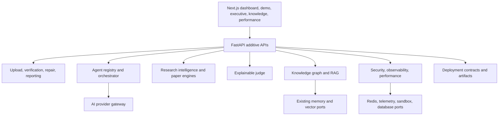

# System Architecture

The application follows additive bounded contexts. HTTP routes compose application services; provider ports isolate external systems; local adapters keep development and demo execution deterministic.
